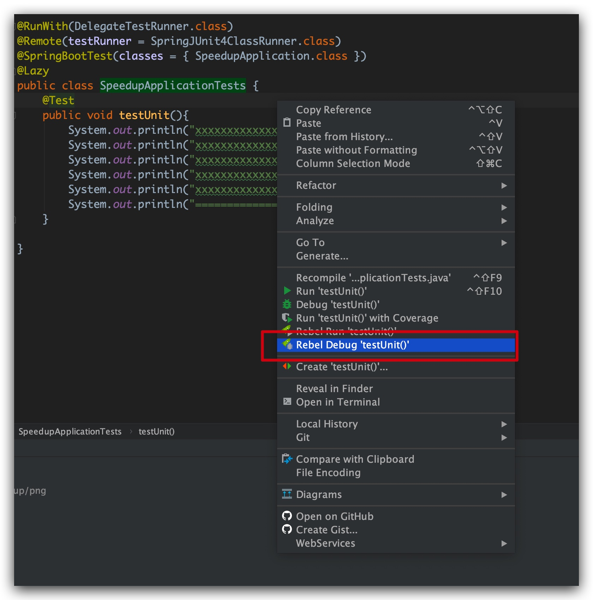
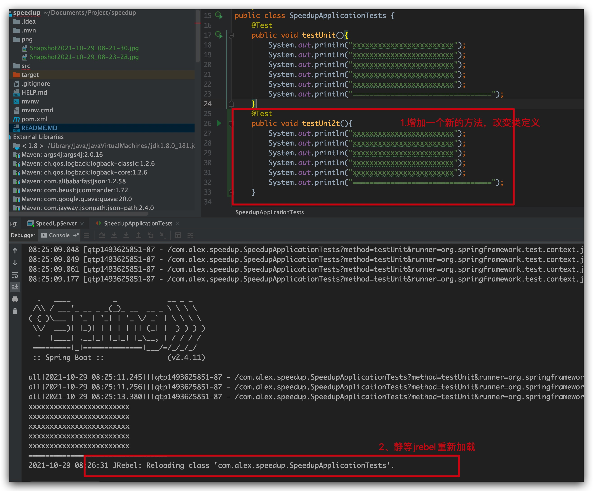

##Introduction
Self-developed Unit testing speed up framework

##Steps
- install jrebel first
- using jrebel to boot Speedup in debug mode
  
- using jrebel to boot Speedup as debug mode
    
    wait a second，later the spring ioc will boot inside the jetty，The whole j2ee container will be initialized and execute the UT
- You can try to change implemention of UT or can refactor the definition of UT,Jrebel will reload the UT after 1-5s
   
- The you can rerun the UT，You will find the UT has taken effective,No matter how you have changed the UT.

## The mechanism
I used a custom class loader to load the whole project to be tested into jetty when jetty was starting.Jetty acts like a http server so that it will be listening on a specific port.I using a custom listener to intercept the UT execution when junit starting and performing the UT case and it can get thw whole context of the UT case including the class name/methond/params etc.The listener will perform a remote invocation(by a GET request with the UT case's package name、class name、method name and related params) after getting the method to be run to the jetty server.After jetty server receiving the http call and getting the parameters(package+class name+method+parameters).The class loader inside the jetty will use these parameters to conduct a reflection invovation and execute the UT case really.
Because the jetty server is run by jrebel so that we can use the capbility of hotswap of jrebel to reload UT on the fly without rebooting.
So we only need to start the jetty server for one time.We don't have to reboot/rerun the junit each time when we change the UT case's logic afterwards
Improve efficiency by at least 70%

## 扩展更新
integrated mockito's custom loader
If class A depends on Class B：

```java
class A{
    @Autowired
    CLassB b;
}
```

So i will use mockito to get class B's mocking object:
````java
@Mock
ClassB b;

@before
public void init(){
    when(b.method()).thenReturn(xxxxx);
}
````
Finish the class dependency construction inside the UT context afterwards

````java

//在ut的上下文中autowired类A，同时使用InjectMocks注解，则会自动对ClassA的实例注入mock对象，完成真实类和mock类的装配，完成集成测试
@Autowired
@InjectMocks
ClassA a;
````

Just experience the finialize effect：
```java
com.alex.speedup.SpeedupApplicationTests
```

any questions,please call me:

