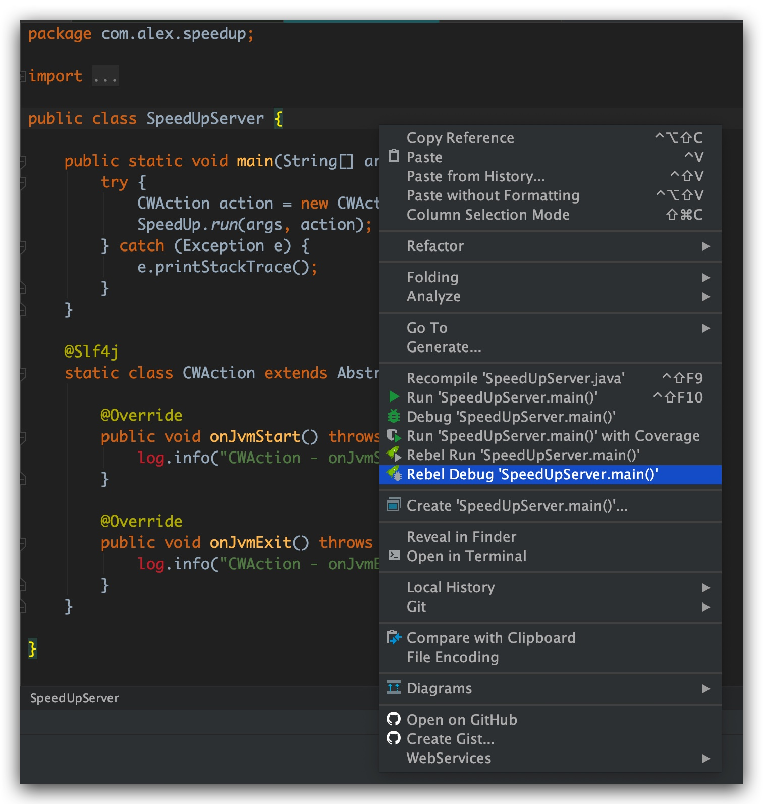

##介绍
单元测试加速框架

##步骤
- 安装jrebel
- 使用jrebel启动Speedup，debug模式启动
  
- 使用jrebel启动单测，debug模式启动
    
    稍等一会，此时spring ioc会在jetty中启动，初始化整个j2ee容器并执行单测
- 可以即时修改单测或者被测业务逻辑，然后等待jrebel热部署，约1-5s
   
- 重跑单测，可以发现逻辑已经即时生效，无论是修改类定义还是一些类的依赖，均可以实时生效

## 原理
拦截单测请求，启动jetty，加上jrebel的热部署，然后使用自定义的类加载器在jetty中启动远程的remote server，将spring ioc在该jetty容器中运行。
拦截本地化的单测调用为远程http调用，jetty获取运行的类和方法信息，执行本地的反射调用
防止每次运行单测都启动容器，只需要启动一次容器可以重复运行单测，修改逻辑和单测逻辑时jrebel会实时热加载，效率提升70%以上

## 扩展更新
集成了mockito的自定义装配
如类A依赖于接口B的实现类：

```java
class A{
    @Autowired
    CLassB b;
}
```

那么使用mockito对B进行mock，首先完成mock对象的定义：
````java
@Mock
ClassB b;

@before
public void init(){
    when(b.method()).thenReturn(xxxxx);
}
````
然后在ut上下文中完成类的装配：
````java

//在ut的上下文中autowired类A，同时使用InjectMocks注解，则会自动对ClassA的实例注入mock对象，完成真实类和mock类的装配，完成集成测试
@Autowired
@InjectMocks
ClassA a;
````

使用该类体验一下：
```java
com.alex.speedup.SpeedupApplicationTests
```

any questions,please call me:
